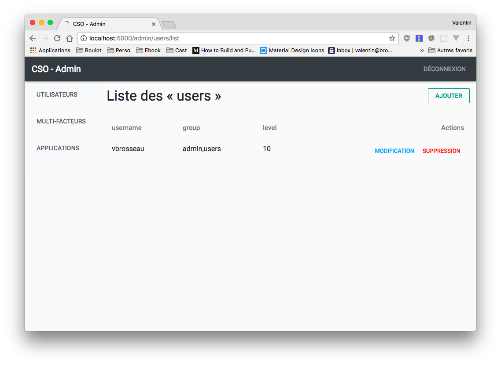

# CSO

CSO is a simple Centralized Sign-on (using to your internal LDAP)

✋ Legacy app i’ve built long time ago… Not perfect but running 24/7 since a looooong time…

- LDAP Auth.
- Timebased OTP for user (Basic implementation)





## WIP

- [X] Fix bad CSRF Implementation.
- [X] Update the Design to something more … modern!
- [ ] Rewrite login (CSOMain module).
  - [X] Implement TOPT during the login.
  - [ ] Add a max SESSION time
- [X] Secret Administration (OTP):
  - [X] Generate.
  - [X] Update.
  - [X] Share via QRCode.

## Installation

```shell
pip install -r requirements.txt
```

## First setup

- Change the ```ldap_server``` and the ```ldap_server``` in the ```parameters.py```.
- Run the ```setup.py```, and enter your « first » admin ```username``` for the CSO. (the username should match with someone on the LDAP server).
- Start the test server ```python main.py```

## Login Workflow

The login workflow is based on a shared secret between the CSO and your « application client ». We can resume the workflow with :

- Client App : Redirect the user to the CSO (Via an HTML Form).
- CSO : User authenticate (or is already authenticate).
- CSO : Redirection to the « Client App » (Via an HTML Form).
- Client App : Check if data signature is OK, and the time code (to prevent authentication replay).
- Client App : Everything is OK, create the local session in your App.

## Run (in dev)

To test quickly the CSO, just run the following command in your favorite terminal :

```shell
python main.py
```

## Run in production

Since I made this application a long time ago, it’s running from many years in production. I use in my setup UWSGI and NGINX to host the app.

UWSGI Configuration :

```
```

NGINX Configuration :

```
```

## Administration

The administration is available via the [Web Interface](http://localhost:5000/admin)